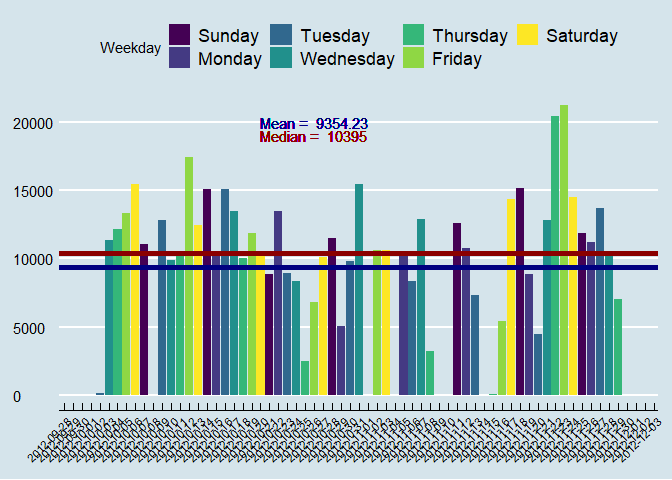
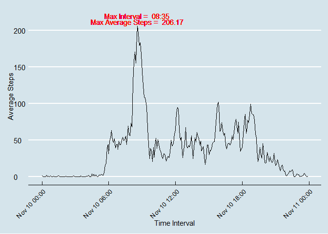
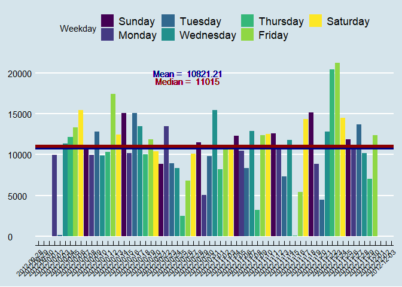
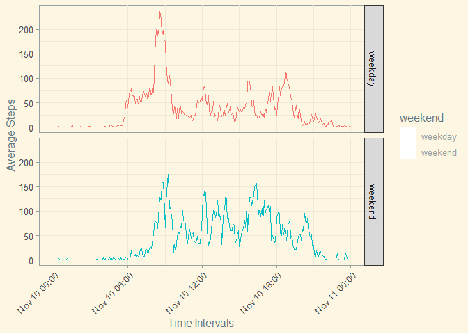

The goal of this analysis is to look at the calculate the mean number of steps taken, any patterns present on a day to day basis, an analysis containing values for the ones that a curretly missing in the data set to see the effect and finally to determine what the difference between activity on the weekend and during the week.

## Loading and preprocessing the data  
This section has been provided to make sure that the required packages are downloaded and that the right file is downloaded if not already present in the current working directory. A redundancy has been provided to prevent downloading the data if it is already present.


```r
require(ggplot2)
```

```
## Loading required package: ggplot2
```

```r
require(dplyr)
```

```
## Loading required package: dplyr
```

```
## 
## Attaching package: 'dplyr'
```

```
## The following objects are masked from 'package:stats':
## 
##     filter, lag
```

```
## The following objects are masked from 'package:base':
## 
##     intersect, setdiff, setequal, union
```

```r
require(ggthemes)
```

```
## Loading required package: ggthemes
```

```
## Warning: package 'ggthemes' was built under R version 4.0.3
```

```r
require(lubridate)
```

```
## Loading required package: lubridate
```

```
## 
## Attaching package: 'lubridate'
```

```
## The following objects are masked from 'package:base':
## 
##     date, intersect, setdiff, union
```

```r
library(scales)


loadCSV <- function(dataDown="", CSV="default.csv", method = NULL){
  
  if(!file.exists(CSV)){
    temp <- tempfile()
    download.file(dataDown, temp, method = method)
    unzip(temp, CSV)
    unlink(temp)
  }
  
  else{
    message("Already Exists.")
  }
}

dataDown <- "https://github.com/LogMan345/RepData_PeerAssessment1/raw/master/activity.zip"

loadCSV(dataDown, "activity.csv")
```

```
## Already Exists.
```


## What is mean total number of steps taken per day?


```r
activity <- read.csv("activity.csv")
activity$date <- as.Date(activity$date)
activity$Weekday <- wday(activity$date, label = TRUE, abbr = FALSE)

sums <- function(dataframe){

activitySums <- dataframe %>% group_by(date, Weekday) %>% 
  summarise(Sum = sum(steps, na.rm = TRUE))

ggplot(activitySums, aes(x = date, 
                         y = Sum, 
                         fill = Weekday)) + 
  geom_bar(stat = "identity" ) +
  scale_x_date(breaks = "1 day",
               ) +
  theme_economist() +
  theme(axis.text.x = element_text(size = 8,
                                   angle = 45,
                                   color = "black",
                                   vjust = 1,
                                   hjust = 1))+
  geom_hline(aes(yintercept = mean(Sum)), 
                 color = "navy",
                 size = 2 ) + 
  geom_hline(aes(yintercept = median(Sum)), 
                 color = "darkred",
                 size = 2 ) + 
  geom_text(aes(label = paste("Mean = ", round(mean(activitySums$Sum), 2) ), 
            x = as.Date("2012-10-26"), 
            y = 20000), 
        color = "navy") +
  geom_text(aes(label = paste("Median = ", round(median(activitySums$Sum), 2) ), 
                x = as.Date("2012-10-26"), 
                y = 19000),
            color = "darkred") +
  xlab(NULL) +
  ylab(NULL) 

}

sums(activity)
```

```
## `summarise()` regrouping output by 'date' (override with `.groups` argument)
```

<!-- -->

The Mean total number of steps is 9354.23. This can be seen by looking at the navy blue line on the graph.
The Median has also been provided and is the dark red line on the graph.

## What is the average daily activity pattern?


```r
activity$interval <- as.POSIXct(strptime(sprintf("%04d", activity$interval), format = "%H%M"))

intervalMax <- function(dataframe) {
  
activityInterval <- dataframe %>% group_by(interval) %>% summarize(Average = mean(steps, na.rm = TRUE)) %>% arrange(interval)
maxAverage <- activityInterval[which.max(activityInterval$Average),]
maxInterval <<- maxAverage$interval[1]
maxAvg <<- round(maxAverage$Average[1], 2)

ggplot(activityInterval, aes(x = interval, y = Average)) +
  geom_line() +
  theme_economist() +
  geom_text(aes(label = paste("Max Interval = ", format(maxInterval, "%H:%M")),
                x = maxInterval,
                y = maxAvg + 14),
            color = "red",
            size = 4) +
  geom_text(aes(label = paste("Max Average Steps = ", maxAvg), 
                x = maxInterval, 
                y = maxAvg + 6),
            color = "red",
            size = 4)  +
  theme(axis.text.x = element_text(angle = 45,
                                   hjust = 1,
                                   vjust = 1,
                                   size = 10)) +
  xlab("Time Interval") +
  ylab("Average Steps")
}

intervalMax(activity)
```

```
## `summarise()` ungrouping output (override with `.groups` argument)
```

<!-- -->

The max interval and steps have been labeled on the graph for convenience purposes. the max interval is 8:35 with a max average steps of 206.17. From looking at the graph it can also be seen that activity seems to peak in the morning and remain relatively sustained into the early evening.


## Imputing missing values


```r
imputedData <- activity %>% 
  mutate(steps = as.numeric(steps)) %>% 
  group_by(interval, Weekday) %>% 
  mutate(steps = ifelse(is.na(steps), mean(steps, na.rm = TRUE), steps)) %>% 
  mutate(steps = round(steps, 2))

sums(imputedData)
```

```
## `summarise()` regrouping output by 'date' (override with `.groups` argument)
```

<!-- -->

The strategy that was used to fill in the missing values was to replace them with the mean step values when an NA was encountered and to just preserve the existing steps. This not only lead to a visual change in the graph but also lead to an overall increase in the mean and median values of the activity data set.

## Are there differences in activity patterns between weekdays and weekends?


```r
imputedData <- imputedData %>% mutate(weekend = ifelse(Weekday %in% c("Saturday", "Sunday"), "weekend", "weekday"))

weekend <- function(dataframe){
  activityInterval <- dataframe %>% group_by(weekend, interval) %>% summarise(Average = mean(steps, na.rm = TRUE))
  ggplot(activityInterval,aes(  x = interval,
                                y = Average,
                                group = weekend,
                                color = weekend)) +
    theme_solarized() + 
    geom_line() +
    facet_grid(weekend~.) +
    theme(axis.text.x = element_text(angle = 45, hjust = 1, vjust = 1, size = 10)) +
    xlab("Time Intervals") +
    ylab("Average Steps")
    
}

weekend(imputedData)
```

```
## `summarise()` regrouping output by 'weekend' (override with `.groups` argument)
```

<!-- -->

Looking at the data it can be seen that the activity starts to rise later in the mornings then during the week. The weekend also has higher sustained activity into the evening where the drop in activity occurs later in the evening as opposed to earlier during the week.
